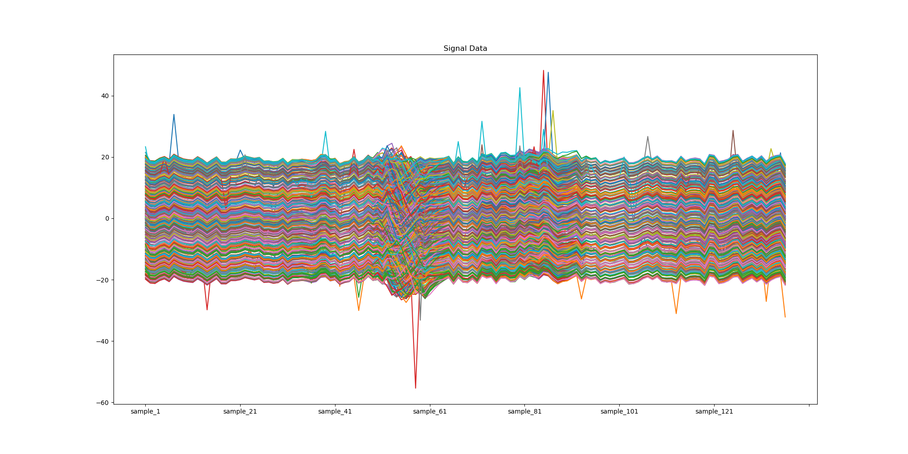
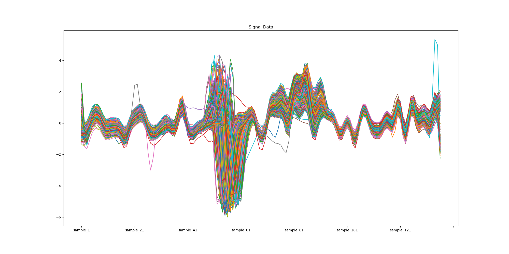
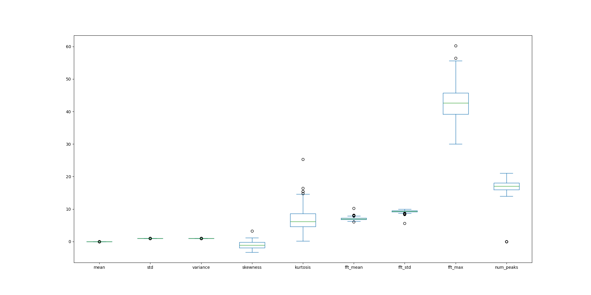
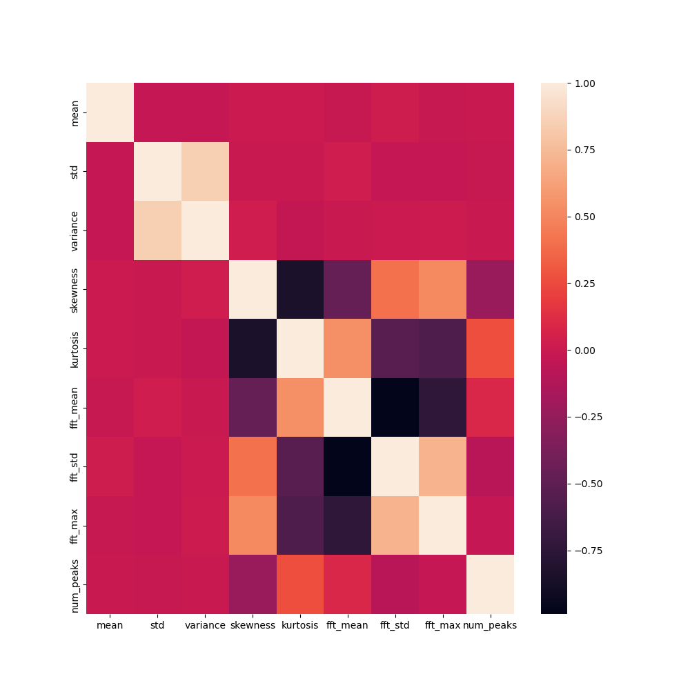
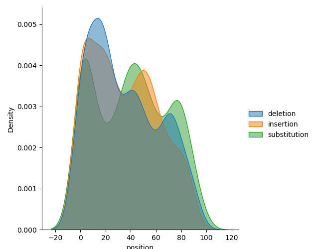
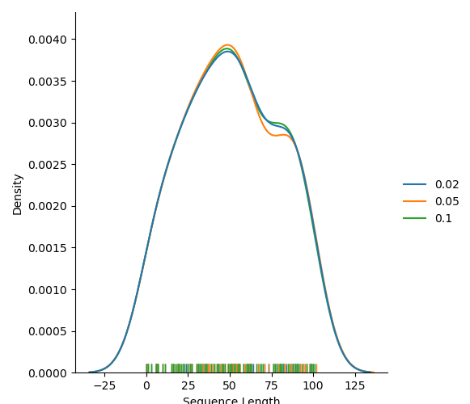
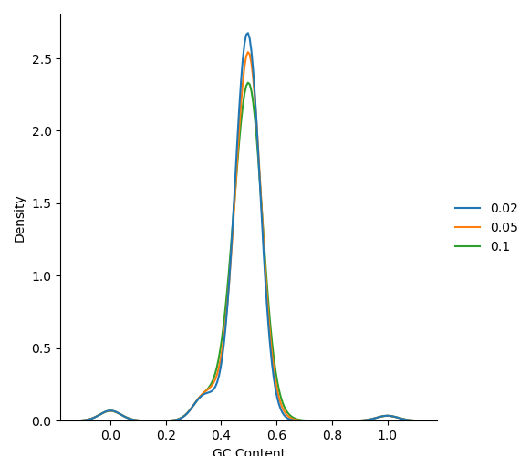

# This repository contains the code for the projects `Signal processing` and `DNA sequence analysis`
This repo needs Python 3.10, pandas, numpy, scipy, matplotlib, seaborn, scikit-learn and biopython to run.
To run this repository create a conda environment with this command conda env create --name envname --file=environments.yml
Activate the environment with conda activate envname
Then run the code with python process.py
## Signal processing
7 signal datasets are provided in the folder `signal_datasets` were processed using Pythons Pandas, Numpy and Scipy libraries. 
The following operations were performed on the datasets:
- Cleaning of signals
- Imputing missing values
- anomaly detection using Isolation Forest
- Smoothing of signals using median filters to remove outliers
- Normalization of signals
- Feature extraction from the signals
- Visualization of the signals before and after processing
```
There are 884 signals in the dataset
Number of rows with missing or NAN values in the dataset are 100
Features generated from the signal data are ['mean', 'std', 'variance', 'skewness', 'kurtosis', 'fft_mean', 'fft_std', 'fft_max', 'num_peaks']
Three features with largest variance are ['variance', 'skewness', 'std']
```

### The images of the signals before and after processing are shown below:



### The boxplot of the features extracted from the signals are shown below:


### The correlation matrix of the features extracted from the signals are shown below:

We can see from this plot that standard deviation and variance are highly correlated with each other. This is expected as variance is the square of standard deviation. We can drop these two features for future statistical analysis.

## Future work
- More feature extraction methods can be used to extract more features from the signals
- Explore median filter and other smoothing techniques to remove outliers
## DNA sequence analysis
3 sets of DNA sequences of different error rates were generated and analysed

### The error position distribution per error type for 10% error rate.


### The sequence length distribution per error rate plot.


### The gc content distribution per error rate plot.


## Future work
- Improve the data structure for storing the error positions and error types