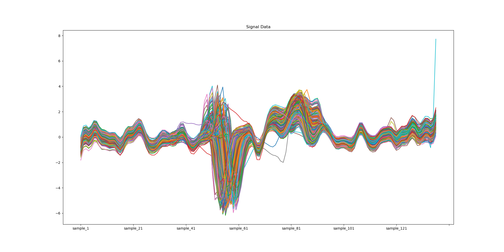

# This repository contains the code for the projects `Signal processing` and `DNA sequence analysis`


## Signal processing
7 signal datasets are provided in the folder `signal_datasets` were processed using Pythons Pandas, Numpy and Scipy libraries. 
The following operations were performed on the datasets:
- Cleaning of signals
- Imputing missing values
- anomaly detection using Isolation Forest
- Smoothing of signals using median filters to remove outliers
- Normalization of signals
- Feature extraction from the signals
- Visualization of the signals before and after processing
```
There are 884 signals in the dataset
Number of rows with missing or NAN values in the dataset are 100
Features generated from the signal data are ['mean', 'std', 'variance', 'skewness', 'kurtosis', 'fft_mean', 'fft_std', 'fft_max', 'num_peaks']
Three features with largest variance are ['variance', 'skewness', 'std']
```

### The images of the signals before and after processing are shown below:



### The boxplot of the features extracted from the signals are shown below:


### The correlation matrix of the features extracted from the signals are shown below:

We can see from this plot that standard deviation and variance are highly correlated with each other. This is expected as variance is the square of standard deviation.
